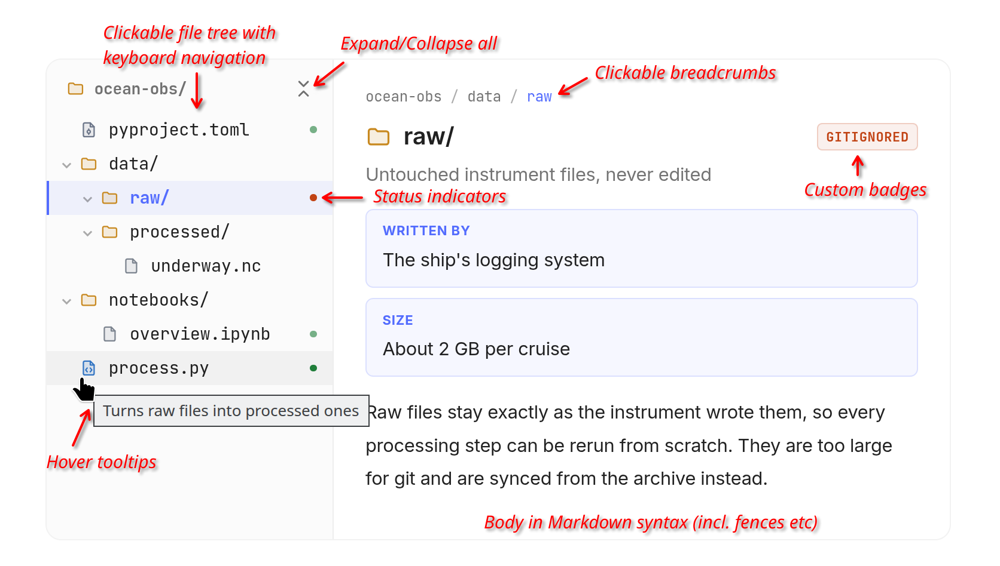

<p align="center">
  
</p>

<h1 align="center">zensical-dirtree</h1>


<p align="center">
  <b>An interactive directory-tree explorer for <a href="https://zensical.org">Zensical</a> documentation sites.</b><br/><br/>
  A clickable tree on the left, a detail panel on the right. <br/>
  Each node's description is ordinary Markdown, so code blocks, <br/> admonitions and links
  look exactly like the rest of your page.
</p>

<p align="center">
  <a href="LICENSE"></a>
</p>




The explorer is rendered to static HTML at build time. A small script (no
dependencies) adds the interactivity, so the content is indexed by search, works
with instant navigation and light/dark mode, and stays readable with JavaScript
disabled.

## Install

```bash
uv add zensical-dirtree          
# or: pip install zensical-dirtree
```

Install it into the same environment as Zensical. After upgrading, rebuild
once with `zensical build --clean`: Zensical reuses cached pages otherwise,
including the stylesheet and script inlined from the previous version.

Tested with Zensical 0.0.67. Zensical is pre-1.0 and the extension uses parts
of its rendering context, so check the [changelog][changelog] when upgrading
either. The development version installs from GitHub:
`uv add git+https://github.com/markusritschel/zensical-dirtree`.

[changelog]: https://github.com/markusritschel/zensical-dirtree/blob/main/CHANGELOG.md


## Usage

For a minimal example, include the following snippet in your markdown page:

`````yaml
````dirtree
root: my-project/
nodes:
  - label: index.html
    id: index-html
    summary: Main page
    fields:
      - label: What this is
        value: This is the main page of the documentation.
      - label: Format
        value: Markdown format, rendered by Zensical.
  - label: README.md
    body: |
      ```markdown
      Some content with *emphasis* and **strong** text.
      ```
      !!! tip "Watch your snippets"
          Files under `base_path` live outside `docs/`, so list them under
          `watch` to rebuild when they change.
    link: http://markdown.org/
````
`````

For more examples see the [example page](https://markusritschel.github.io/zensical-dirtree).


## Configure

Include the following toml table in your `zensical.toml`:
```toml
[project.markdown_extensions.zensical_dirtree]
```

If you want to use badges, they need to be defined in this table as follows:
```toml
[project.markdown_extensions.zensical_dirtree]
badges.local = { label = "local", color = "blue" }
badges.committed = { label = "committed", color = "green", indicator = true }
badges.gitignored = { label = "gitignored", color = "orange", indicator = true }
badges.generated = { label = "generated", color = "amber" }
```

### Body files

If you want to use `body_file` in your tree, that is, load the body of a node from a separate Markdown file, you need to set the `base_path` option to the directory where these files are located. 
You should also add that directory to the `watch` option, so that Zensical rebuilds the page when a body file changes.
Also, don't forget to create that directory relative to your project's root and put the respective files in there.

For example, in `zensical.toml`:

```toml
[project]
watch = ["snippets"]            # same as base_path; see below

[project.markdown_extensions.zensical_dirtree]
base_path = "snippets"          # where body_file paths resolve; outside docs/
badges.local = { label = "local", color = "blue" }
badges.committed = { label = "committed", color = "green", indicator = true }
badges.gitignored = { label = "gitignored", color = "orange", indicator = true }
badges.generated = { label = "generated", color = "amber" }
```

Make sure that `pymdownx.superfences` is in your `[project.markdown_extensions]` section in `zensical.toml`.


### Things to know:

- **No `custom_fences` entry needed.** The extension registers the `dirtree`
  fence with `pymdownx.superfences` itself, in whatever order the extensions
  are listed. SuperFences must be enabled, and the build fails with a clear
  message if a page uses a `dirtree` fence without it.
- **Naming any Markdown extension replaces Zensical's defaults.** As soon as
  `zensical.toml` contains one `[project.markdown_extensions.*]` table, Zensical
  drops its whole built-in set (SuperFences, highlighting, admonitions, …).
  You would need to list them again. Sites created with `zensical new`, however,
  already list them all; otherwise copy the complete default list from
  [`example/zensical.toml`](https://github.com/markusritschel/zensical-dirtree/blob/main/example/zensical.toml).
- **No stylesheet or script to set up.** The extension inlines both before the
  first tree on each page (about 6 KB gzipped). The `--dirtree-*` custom
  properties (see "Icon colours" below) can be overridden from a
  stylesheet of your own (`extra_css`) as before. Since the inlined CSS comes
  after your stylesheets, any other rule needs a more specific selector than
  the one it overrides, e.g. prefixed with `.md-typeset`. If your Content
  Security Policy forbids inline scripts, or you
  want to replace the script, set `inline_assets = false`, run
  `zensical-dirtree install --docs-dir docs` (again after each upgrade) and
  list the two copied files in `extra_css` and `extra_javascript`.
- **Add `base_path` to `watch`** if you use snippets. 
  Zensical caches each page by its own source.
  Without `watch`, an edited body file is ignored by `zensical serve` **and by
  `zensical build`** until the page that embeds it changes. With it, every edit
  rebuilds. The extension logs a warning when `base_path` isn't covered by
  `watch`.

### Badge colours

Named colours adapt to light and dark mode: `green`, `orange`, `amber`, `red`,
`blue`, `purple`, `grey` (the default). Any other value is used as a raw CSS
colour, e.g. `color = "#0e7490"` or `color = "rgb(14 116 144)"`.

### Status dots

Badges with `indicator = true` also appear as a coloured dot at the right edge
of the node's row in the tree, like a git status marker. If a node has several
indicator badges, the first one listed on the node is shown. The dot's tooltip
is the badge label, which screen readers also announce with the item.

### Icon colours

Icons are coloured by type, with light and dark values. Override the custom
properties in a stylesheet of your own to match your palette:

```css
.dirtree {
  --dirtree-icon-folder: #c98a1a;
  --dirtree-icon-code: #2f76c4;
  --dirtree-icon-config: #6b7689;
  --dirtree-icon-md: #8a5fd1;
  --dirtree-icon-file: #7d8590;
}
```

For dark mode, set them under `[data-md-color-scheme="slate"] .dirtree`.
The tree pane's shading works the same way: `--dirtree-tree-bg` (and
`--dirtree-tree-hover` for hovered rows); set it to `transparent` for no shading.

## Syntax

Use four backticks for the outer fence so bodies can contain ordinary
triple-backtick code blocks. The content is YAML.

`````yaml
````dirtree
root: your-project/
nodes:
  - label: zensical.toml
    id: config-toml
    badges: [committed]
    summary: Main configuration
    fields:
      - label: Read when
        value: At startup
    body: |
      Controls how the site is built. Example:

      ```toml
      [project]
      site_name = "My docs"
      ```
    link: reference/config.md
  - label: src/
    expanded: true
    children:
      - label: main.py
        body_file: main-py.md
````
`````

### Top level

| Key              | Notes                                                                                                                           |
| ---------------- | ------------------------------------------------------------------------------------------------------------------------------- |
| `nodes`          | **Required**. Non-empty list of nodes.                                                                                          |
| `root`           | Label shown above the tree and at the start of each breadcrumb.                                                                 |
| `contents_limit` | Entries a folder's "Contents" list shows before a "Show N more" button. Default: 10. Without JavaScript the full list is shown. |

### Nodes

| Key         | Type                 | Notes                                                                                                                                     |
| ----------- | -------------------- | ----------------------------------------------------------------------------------------------------------------------------------------- |
| `label`     | str                  | **Required.** Display name. A trailing `/` or a `children` key makes it a folder.                                                         |
| `id`        | str                  | Slug for deep links (`[A-Za-z0-9_-]`). Default: the slugified label path, e.g. `src/main.py` → `src-main-py`. Must be unique on the page. |
| `summary`   | str                  | One line under the title, also shown in the parent's "Contents" list and as a plain-text tooltip on the tree row. Inline Markdown.        |
| `body`      | str                  | Markdown. Mutually exclusive with `body_file`.                                                                                            |
| `body_file` | str                  | Markdown file, relative to `base_path`.                                                                                                   |
| `badges`    | list[str]            | Keys from the badge configuration.                                                                                                        |
| `fields`    | list[{label, value}] | Label/value callouts. `value` is inline Markdown.                                                                                         |
| `link`      | str                  | Adds a "Full docs →" link. Relative `.md` links are resolved like any page link.                                                          |
| `children`  | list[node]           | Makes the node a folder.                                                                                                                  |
| `expanded`  | bool                 | Folder starts open. Default `false`.                                                                                                      |
| `icon`      | str                  | `folder`, `file`, `code`, `config` or `md`. Default: derived from type and extension.                                                     |

### Ids and deep links

Every node's panel has the id `dirtree-<id>`, so `[see main.py](#dirtree-src-main-py)`
selects that node from anywhere on the page, expands its folders, and scrolls
the explorer into view; links from other pages work too
(`page.md#dirtree-src-main-py`). Selecting a node updates the address bar.

Ids are unique across the whole page. When two nodes would get the same default
id, including across two trees on one page, the later one gets a `-2`, `-3`, …
suffix. Two explicit ids that clash are a build error.

Those suffixes follow the order of trees on the page, so they shift when a tree
is added above another or the same tree file is shown twice. On pages with
several trees, give an explicit `id` to every node you link to; explicit ids
never change.

### Errors

Mistakes fail the build with the page, node and cause, for example
`dirtree: index.md: node 'src/main.py': body_file not found: /…/snippets/main-py.md`.
This covers invalid YAML, unknown keys, `body` together with `body_file`, a
missing body file, a `body_file` or `base_path` outside the project root, unknown
badges or icons, unsafe badge colours and duplicate ids.
For a tree loaded from a file, the message names the file too:
`dirtree: index.md: trees/project.yaml: node 'src': unknown icon 'rocket'`.

## Trees in their own files

A large tree, or one shown on several pages, can live in its own YAML file.
The fence then holds a single line:

````yaml
```dirtree
src: trees/project.yaml
```
````

The file has exactly the format of a fence's content (`root`,
`contents_limit`, `nodes`). Its path resolves against `base_path`, like `body_file`, so with
`base_path = "snippets"` the file above is `snippets/trees/project.yaml`.
`body_file` paths inside it resolve against `base_path` as well. Keep
`watch = ["snippets"]` so edits to tree files rebuild the pages using them.

`src` stands alone: the other top-level keys belong in the file, and a
tree file cannot load another one.

### Editor validation

The package ships a JSON Schema for tree files. Copy it next to them:

```bash
zensical-dirtree schema --output snippets/trees/dirtree.schema.json
```

and reference it from the first line of each tree file:

```yaml
# yaml-language-server: $schema=dirtree.schema.json
root: your-project/
nodes:
  - label: …
```

Editors with YAML language support then offer completion,
show each key's description on hover and flag mistakes as you type. The schema
is for editing only; the build still runs its own checks. Re-run the command
after upgrading.

## Behaviour

- Click a node to select it and show its panel. Clicking a folder also expands
  it. The arrow beside a folder only toggles it.
- Keyboard (WAI-ARIA tree pattern): <kbd>↑</kbd>/<kbd>↓</kbd> move through
  visible nodes, <kbd>→</kbd> expands or enters a folder, <kbd>←</kbd>
  collapses or moves to the parent, <kbd>Home</kbd>/<kbd>End</kbd> jump,
  <kbd>Enter</kbd>/<kbd>Space</kbd> select and toggle. The tree is a single tab stop.
- An icon button above the tree expands or collapses all folders; its label
  ("Expand all" / "Collapse all") shows as a tooltip and is read by screen
  readers. Enable Zensical's `content.tooltips` feature for styled tooltips.
- Selections are announced through a polite live region.
- Below 700px wide, the tree stacks above the panel.
- Without JavaScript: a nested list of links, followed by every node's
  description.

## Known limitations

- **Relative links inside a `body_file`** resolve relative to the page that
  embeds the tree, not to the body file.
- **Live reload of body files needs `watch`** (see "Configure" above).
  Zensical fixes its watch list while reading the configuration, before
  extensions load, so the extension cannot add `base_path` itself.
- **Outside Zensical** (plain Python-Markdown, e.g. in tests), bodies render
  with a fixed standard extension set rather than the site's own.
- Headings inside a body get ids but never appear in the page's table of
  contents.
- One root per tree; put two trees on the page for two roots.

## Example site

`example/` exercises every feature: nesting, badges (named and raw colour),
fields, `body` and `body_file`, icon overrides, status dots, two trees on one
page, a table of deep links, a second page for instant navigation, and a tree
loaded from a schema-checked YAML file. The site for the latest release is
published at <https://markusritschel.github.io/zensical-dirtree/>. 

## Development

```bash
uv sync
uv run pytest                   # unit tests + real Zensical builds of example/
uv run ruff check . && uv run ruff format --check .
uv run zensical-dirtree schema --output example/snippets/trees/dirtree.schema.json  # after editing the schema
```

## Contact & Issues

For questions or issues, please contact me via git@markusritschel.de or open an [issue](https://github.com/markusritschel/oceanpack/issues).

---
&copy; Markus Ritschel 2026
